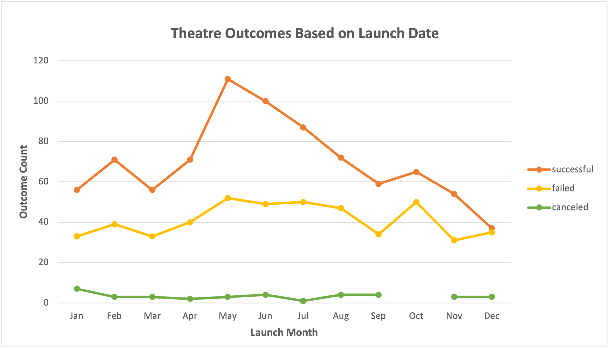
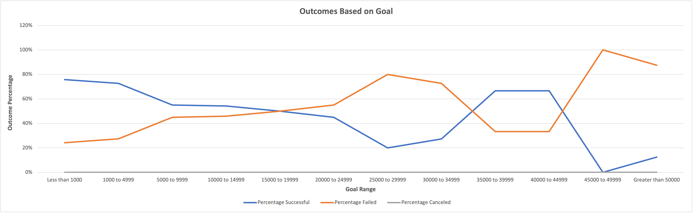

# Kickstarting with Excel

## Overview of Project

This project is to understand the relationship of a campaign outcome based on different launch time and funding goals. To perform this analysis a dataset containing serveral funding campaigns run in the past serveral years across different categories will be used.

### Purpose

The goal of this project is to understand different parameters to consider for a successful campaign. Few options planned to explore are to check if there is any specific time period where campaigns are more successful and if campaigns funding goals play any role its success. 

---

## Analysis and Challenges

### Analysis of Outcomes Based on Launch Date

The first analysis was done by creating a pivot table that could filter based on category and have the count of campaings by outcome over each months. This helped in giving a new table with all required data grouped as needed. The below chart was built to show the outcome based on campaigns lauched over the years in different months for the parent category of theatre. 

There was a clear indication that the months of May, June and July had higher successful campaingns. We could also observe that the failed and cancelled campaigns remained comparitively in the same range through the year giving the indication again that mid year has a higher success rate.

### Analysis of Outcomes Based on Goals

The second analysis was done by putting a formula to get the outcome percentage based on funding goal ranges. An excel function of COUNTIFS was used to filter and get counts based on the required filter criteria. The below chart shows the percentage of outcomes that were successful or failed for "plays" subcategory based on the funding goal ranges. 

The chart clearly shows a higher success rate lower funding goals and higher failure rate for higher funding goals. There is a level of uncertainity in the middle range ($20,000 to $45,000) where the the success percentages moves around. This could also attribute the smaller sample size as only 4% of the dataset belongs to this funding range.

### Challenges and Difficulties Encountered

For building the data set based on launch date, there was no direct field available. A conversion formula was used to convert the epoch time to a normal date time and set to use only months in the pivot table.

For building the data set on outcome percentage based on goal ranges, one option was to type in all the ranges in the formula. Instead used a formula to refer to another columns to derive the data. This can help in changing ranges in future if needed. Also enabled a capability to have a variable subcategory option to check on other subcategory results.

Link to the file having these formulas: [Kickstarter_Challenge](Kickstarter_Challenge.xlsx)

From a data standpoint, lack of data with higher funding goals posed a challenge to assess the campaign success rate in these scenarios. One option would be to use a 50% probability in these cases until we get more data.

---

## Results

- What are two conclusions you can draw about the Outcomes based on Launch Date?

    1. Campaigns Mid year (May, Jun and July) has a higher success probability compared to other months. Due to this very reason observed higher number of campaigns happen mid year.
    2. Failed/Cancelled campaigns remained at the same rate though the year further giving confidence on this data point.

- What can you conclude about the Outcomes based on Goals?

    Lower campaign funding goals (less than $20,000) had a higher success rate, while higher funding goals had a lower success rate.

- What are some limitations of this dataset?

    The dataset did not have more campaign details with higher funding goals not able to make a good judgement on their success rate.

- What are some other possible tables and/or graphs that we could create?

    * A box plot could help in checking if there are any outliers
    * Relation to number of backers to success percentage
    * Mean/Median/Standard Deviation based on goals and pledged amount
